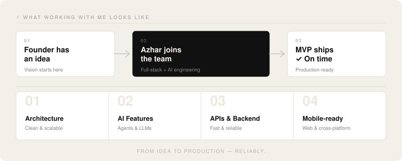

# Hey 👋 I'm Azhar Hayat

 

---

### About me

I'm a **Full-Stack + AI Engineer** with **2+ years** of experience building web and mobile products across **SaaS · Gaming · FinTech · E-commerce · Healthcare · PropTech · EdTech · MarTech · Logistics · Marketplaces**.

I help **founders and startups** go from idea → working product, **fast and reliably.** Whether you need an MVP validated in weeks or a scalable AI-powered system built on solid foundations — I've got you.

- 🚀 **Software Engineer** @ TAG Solutions
- 🤝 Open to **collaborations, MVP projects, and AI product work**
- 🌱 Currently deepening expertise in **AI Agents, LLMs & Machine Learning**
- 💬 Ask me about **React, Node.js, NestJS, AI integrations**
- 📬 **Azharhayat271@gmail.com**
- ⚡ Fun fact: Most productive at 2am

---

### ⚡ What working with me looks like

  

---

### Frontend

---

### Backend

---

### AI & Cloud

---

### 🛠️ Tools & Workflow

---

### 📊 GitHub Stats

 

---

### Industries I've built for

`SaaS` &nbsp; `FinTech` &nbsp; `E-commerce` &nbsp; `Healthcare` &nbsp; `EdTech` &nbsp; `PropTech` &nbsp; `Gaming` &nbsp; `Logistics` &nbsp; `MarTech` &nbsp; `Marketplaces`

---

### Let's connect

Have an idea you want to ship? Building something with AI? Just want to talk tech?

 

